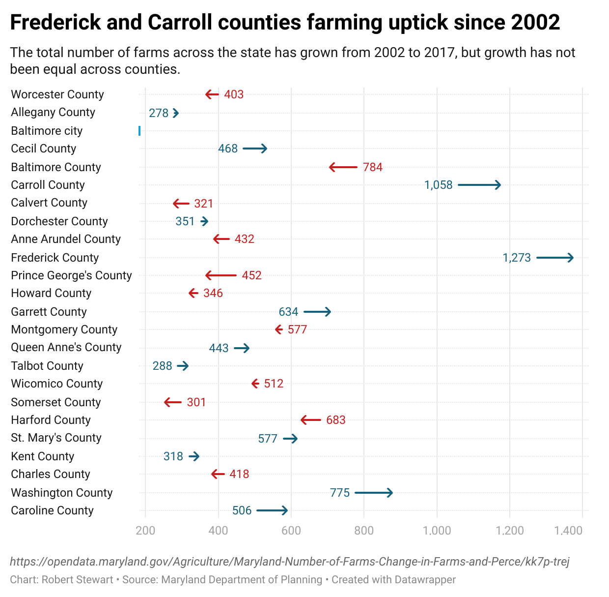

```{r setup, include=FALSE}
knitr::opts_chunk$set(echo = TRUE)
```

## R Markdown

This is an R Markdown document. Markdown is a simple formatting syntax for authoring HTML, PDF, and MS Word documents. For more details on using R Markdown see <http://rmarkdown.rstudio.com>.

When you click the **Knit** button a document will be generated that includes both content as well as the output of any embedded R code chunks within the document. You can embed an R code chunk like this:

```{r}
#loading libraries
library(tidyverse)
library(janitor)

# adding geographic library for mapping
library(sf)
library(tigris)

# adding census library data for comparison. 
library(tidycensus)
```

```{r}
#loading data on the change of farms
maryland_farms <- read_csv("data/maryland_number_of_farms.csv")

maryland_farms

#loading data on changing farm acres in Maryland
maryland_acres <- read_csv("data/maryland_acres.csv")

maryland_acres

```
```{r}
#loading geographic data to experiment with creating a map of the data.
md_farms_zip <- st_read("data/md_zips/BNDY_ZIPCodes11Digit_MDP.shp")

view(md_farms_zip)

farm_counties <- counties()

#narrowing county data to show just Maryland counties. 
md_farms_county <-farm_counties|>
  filter(STATEFP == "24")
```

```{r}
#cleaning data 

#cleaning MD farms
maryland_farms_cleaned <- maryland_farms|>
  rename(county = Jurisdiction)|>
  clean_names()|>
  select(-date_created)

#clearning zipcode dataframe
md_farms_county_cleaned <- md_farms_county|>
  rename(county = NAMELSAD)|>
  clean_names()

#cleaning md farms zip
md_farms_zip_cleaned <-md_farms_zip|>
  rename(zip_code = ZIPCODE1)|>
  clean_names()
```

**I see that the number of farms in Maryland has increased but it has decreased in certain counties. I am going to pull in census data to see if there's any correlation between median income and the increase or decrease in farms**
```{r}
#pulling in acs

md_acs <- get_acs(geography = "county",
                  variables = c(medincome = "B19013_001"), 
                  state = "MD", 
                  year = 2020)|>
  clean_names()

```

```{r}
#cleaning the acs income data for merging
md_acs_cleaned <- md_acs|>
  mutate (county =(str_remove_all(name,", Maryland")))

md_acs_renamed <- md_acs_cleaned |>
  rename(medincome = estimate)

#selecting desired columns
md_acs_final <- md_acs_renamed |>
  select(geoid,medincome,county)
```

**Now I would like to join the dataframes to make some charts and some maps**

```{r}
#joining the geo data with the counties and farms data
maryland_counties_and_farms <-
  md_farms_county_cleaned|>
  left_join(maryland_farms_cleaned, join_by(county))
```

```{r}
#joining geo-data and farm data with medincome dataframe
md_farms_and_inccome <- maryland_counties_and_farms |>
  left_join(md_acs_final, join_by(county))|>
  select(-name, -geoid.y)

glimpse(md_farms_and_inccome)

```

```{r}
#changing some characters to numbers
md_farms_and_inccome_v2 <- md_farms_and_inccome|>
  mutate(change_all = as.numeric(change_in_number_of_farms_2002_2017), 
         total_2002 = as.numeric(number_of_farms_2002),
         total_2007 = as.numeric(number_of_farms_2007),
         total_2012 = as.numeric(number_of_farms_2012),
         total_2017 = as.numeric(number_of_farms_2017),
         change_2002_2007 =as.numeric(change_in_number_of_farms_2002_2007), 
         change_2007_2012 =as.numeric(change_in_number_of_farms_2007_2012),
         change_2012_2017 =as.numeric(change_in_number_of_farms_2012_2017)
  )

glimpse(md_farms_and_inccome_v2)
```
**I want to see if median income is related to the number of farms, so I will do a scatter plot**
```{r}
#creating a scatter plot showing median income compared to the increase in number of farms per county.
md_farms_and_inccome_v2 |>
  ggplot() +
  geom_point(
    mapping = aes(x=medincome, y= change_all))

```

**I don't see a clear correlation between median income and the increase or decrease of amount of farms, so I will create a map to see if there's an interesting story there**

```{r}
ggplot()+
  geom_sf(data = md_farms_and_inccome_v2, aes(fill=change_all))+
            scale_colour_viridis_b(option="magma") +
  theme_minimal()
```

*Looking at the map you can see that the greatest increase in farmland is in Carroll, Frederick, and Washington counties. The greatest decrease of farmland appears to be in Prince George's and Baltimore counties.*

**PITCH 1:**

*Prince George's County has an interesting demographic profile in the state of Maryland. It's one of the counties with the largest population of African Americans and one of the counties with the fastest growing Hispanic communities in the state. Historic injustices such as segregation and redlining have taught us that  policies and practices in areas where minority groups live can have long lasting impacts on the well-being of people in those communities to include their perception of belonging. This story will explore the decrease in farms within Prince George's County. I will identify a few farms that have left and explore the impact been on people living near the former farms*


**Now, I think it would be helpful to just have a visual showing where farmland has been increasing and where it's been decreasing. I will export the data to datawrapper to help me figure out what the trends look like**

```{r}
write_csv(md_farms_and_inccome_v2, file = "data/md_farm_data.csv" )
```

```{r, echo=FALSE}

```

**So the chart shows me clearly which counties have lost farms and which counties have gained farms in Maryland, and I know the growth is not related to median household income. If I were to pitch a story at this point, I would look at the outliers: Baltimore County has lost the most farms in the 15 year span, whereas Frederick county has gained the most

So, I want to explore some more data to see what other stories are possible. I found more data that was not on the open data portal - from the National Agricultural Statistics Service that has more information about Maryland farms. So, I'm going to upload that to see if there are anymore interesting angles.**

```{r}
crop_farms_2007 <- read_csv("data/total_farms_crops_2007_zipcode.csv")
crop_farms_2017 <- read_csv("data/total_farms_crops_zipcod_2017.csv")
animal_farms_2007_2017 <- read_csv("data/md_farms_animals_zipcode.csv")
```

```{r}
#binding rows

farm_land_combined <- bind_rows(list(crop_farms_2007, crop_farms_2017, animal_farms_2007_2017))|>clean_names()
glimpse(farm_land_combined)
```
**In the data there's a category that will allow me to isolate the most lucrative farms - those that make more than $250,000. I want to see what those farms look like per zip code both in 2007 and 2017**
```{r}
#finding lucrative farms in 2007

lucrative_farms_2007<-farm_land_combined |> 
  filter(domain_category == "SALES: (250,000 OR MORE $)")|>
  filter(year == "2007")|>
  mutate(zip_code = as.character(zip_code))|>
  arrange(desc(value))
```
**The zip code with the most lucrative amount of farms in 2007 is 21632. I want to see if that's changed in 2017.** 

```{r}
#finding lucrative farms in 2017

lucrative_farms_2017<-farm_land_combined |> 
  filter(domain_category == "SALES: (250,000 OR MORE $)")|>
  filter(year == "2017")|>
  mutate(zip_code = as.character(zip_code))|>
  arrange(desc(value))
glimpse(lucrative_farms_2017)

```
**There are ten less zipcodes yielding lucrative farms in 2017 than there were in 2007. The zipcode 21632 is still top of the list, and it has gained more lucrative farms. I think it would be nice to view a heat map of both of these years.**

```{r}
#getting rid of unnecessary columns
trimmed_lucrative_2007 <- lucrative_farms_2007|>
  select(zip_code, data_item, value)

trimmed_lucrative_2017 <- lucrative_farms_2017|>
  select(zip_code, data_item, value)

glimpse(trimmed_lucrative_2007)

```

```{r}
#joining zipcode data with the lucrative farm data
lucrative_geo_2007<- md_farms_zip_cleaned |> left_join(trimmed_lucrative_2007, join_by(zip_code))|>replace_na(list(value = 0))
lucrative_geo_2017<- md_farms_zip_cleaned |> left_join(trimmed_lucrative_2017, join_by(zip_code))|> replace_na(list(value = 0))

```

```{r}
#seeing if I can create a map that highlights zipcodes with greater numbers of highly lucrative farms in 2007 and 2017.
ggplot() +
  geom_sf(data=lucrative_geo_2007, aes(fill=value))+
            scale_colour_viridis_b(option="magma", trans="log") +
  scale_fill_continuous(high = "#132B43", low = "#56B1F7")
  theme_minimal()
  
ggplot() +
  geom_sf(data=lucrative_geo_2017, aes(fill=value))+
            scale_colour_viridis_b(option="magma", trans="log") +
  scale_fill_continuous(high = "#132B43", low = "#56B1F7")
  theme_minimal()
```
*The maps plotted above show the change in the number of highly lucrative farms. You do get a sense that many of the highly lucrative farms are in zipcodes on the Eastern shore. It appears that one zipcode in Garrett county has lost some highly lucrative farms. It also appears that central Maryland has gained some highly lucrative farms. *

**PITCH 2**

*The demand for locally grown food in the United States increased during the first decades of the 21st century compared to the last decade of the 20th, according to a report produced by the Federal Reserve Bank of St. Louis. Local farms can have a positive impact on the economy and they can strengthen local food systems. But industrial agriculture can also be detrimental to the environment and the health of communities near the farms. With the number of highly lucrative farms growing in certain zip codes in central Maryland, this story will examine the environmental repercussions of that change. Looking at the two zip codes with the greatest number of highly lucrative farms in central Maryland, I will talk with environmental experts to determine ways to check the impact of the farms on the environment.*

**PITCH 3 **

*Local farms, especially those providing communities with access to fresh food can create a sense of community pride. Lucrative farms can also have a positive impact on the local economy including providing jobs. But what happens when a farm leaves the community? Between 2007 and 2017, Garrett County saw the departure of a number of highly lucrative farms. This story would examine what impact  the loss of these farms has had on the community. I will interview residents in the zip code to understand their perceptions after losing the farms and then examine the concept more broadly in order to put it into context for the broader state of Maryland. *

```
